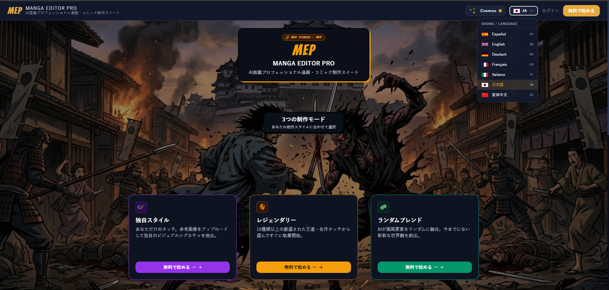
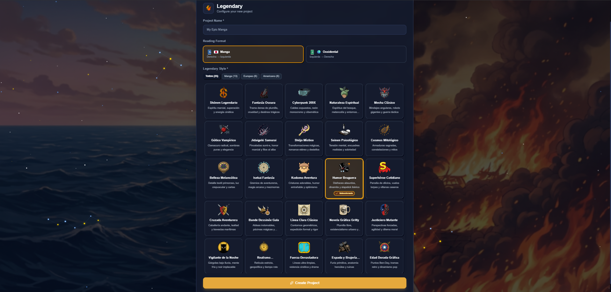
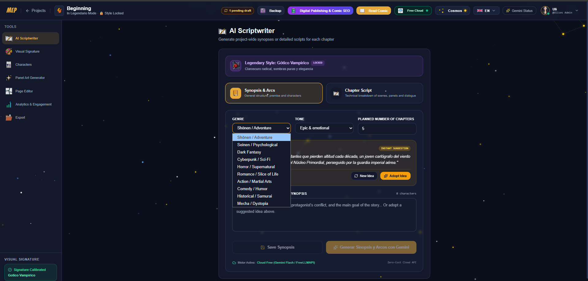
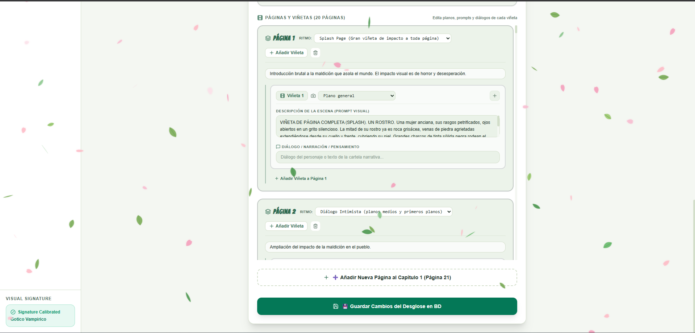
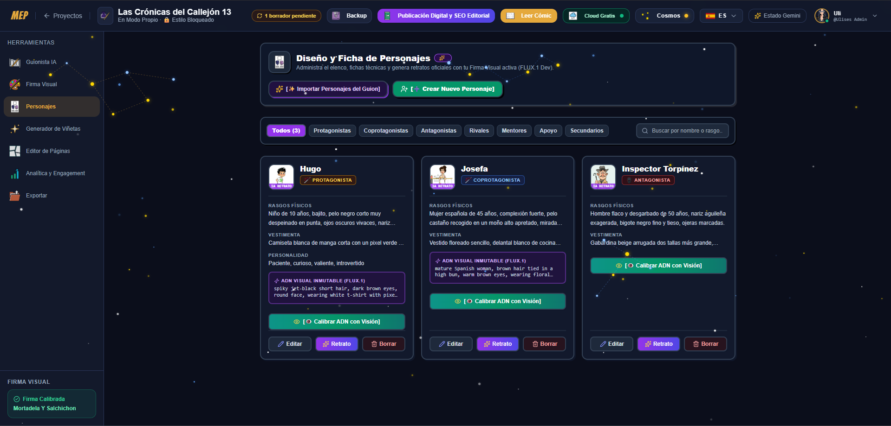
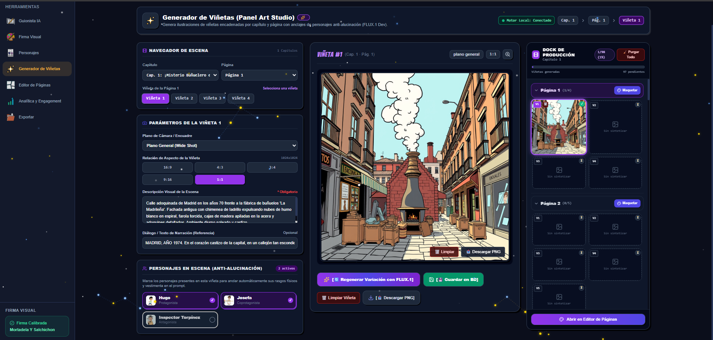
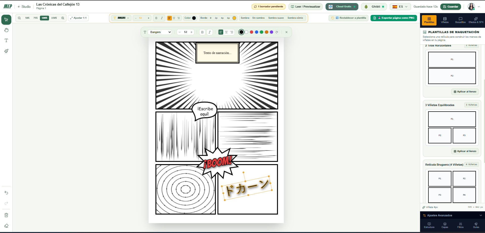
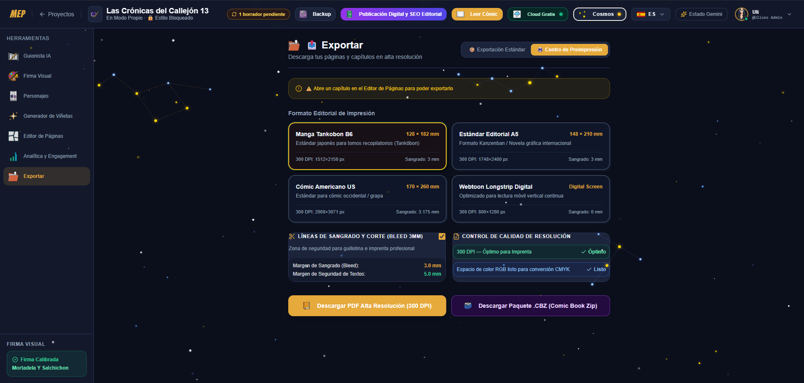

\# MEP — Manga Editor Pro (v2.0)

\*\*Full-Stack Creative Studio Engine, Offline-First PWA \& Distributed AI Pipelines\*\*

> 🔴 **Active Test Environment (Live Demo)**
> Temporary access for testers: [Try Manga Editor Pro Live](https://sam-notes-virtual-shop.trycloudflare.com)
> *(Available only while the local test environment is running).*

A modern web-based comic and manga creation suite engineered with an asynchronous micro-services architecture, high-performance interactive 2D canvas manipulation, relational data persistence, and multi-tier AI inference runtime (Zero-Cloud local GPU \& Cloud fallback).

## 📸 Capturas de la Suite / Preview

| Bienvenida & Modos | Selección Legendaria |
| :---: | :---: |
|  |  |

| Guionista (Sinopsis & Arcos) | Desglose de Capítulos |
| :---: | :---: |
|  |  |

| Fichas de Personajes | Generador de Viñetas (Panel Art) |
| :---: | :---: |
|  |  |

| Editor de Páginas & Lienzo | Módulo de Exportación |
| :---: | :---: |
|  |  |


\---


\## 🏛️ System Architecture


```text

\[ Client Tier (PWA / SPA) ]

&#x20; ├── React 18 + Vite (Rolldown chunks, Zustand state management)

&#x20; ├── Interactive Graphics Engine: Fabric.js v5 (Vector clipPaths, layer Z-index, screentone WebGL filters)

&#x20; ├── Offline Storage: IndexedDB (Local canvas serialization \& draft recovery)

&#x20; └── UI / Theme Engine: Tailwind CSS (Dynamic Ghibli / Cosmos themes \& i18n 7 languages)

&#x20;            ▲

&#x20;            │ (RESTful API / JSON-LD / JWT Auth)

&#x20;            ▼

\[ Application Backend (FastAPI) ]

&#x20; ├── Runtime: Python 3.11 (Uvicorn async worker)

&#x20; ├── Validation \& Schema: Pydantic v2

&#x20; ├── Persistence Layer: SQLAlchemy ORM -> SQLite (Dev) / PostgreSQL 16 (Prod)

&#x20; └── Test Suite: Pytest + HTTPX (Full E2E integration test coverage)

&#x20;            ▲

&#x20;            │ (Inference Routing / Local REST APIs)

&#x20;            ▼

\[ Dual-Engine AI Pipelines ]

&#x20; ├── Local Edge Engine: Ollama (Qwen 2.5:7b @ :11434) + ComfyUI IP-Adapter (@ :8188)

&#x20; └── Cloud Scalability: Gemini 2.5 Flash + Flux generation pipelines


⚙️ Core Technical Features
Advanced In-Memory Canvas Engine: 30-state undo/redo history buffer, JSON deep serialization, magnetic snapping grids (8px/16px/32px), and non-destructive post-processing filters (halftone screentones, contrast thresholding).

Multi-Format Interactive Reader: Continuous vertical Webtoon scroll, Oriental Manga (Right-to-Left / RTL), and Western (Left-to-Right) layout engines with native keyboard navigation.

Production-Grade Microservices & DevOps: Multi-stage Docker containers (python:3.11-slim backend, Nginx on Alpine frontend), automated GitHub Actions CI/CD workflows, and database migration scripts (migrate_to_postgres.py).

Offline-First PWA Architecture: Full standalone compliance via manifest.json, responsive asset rendering, and seamless network loss tolerance.

🛠️ Stack & Technologies
Frontend: React, Vite, Fabric.js, Tailwind CSS, Zustand, i18next.

Backend: FastAPI, Python 3.11, SQLAlchemy, Pydantic, Pytest, JWT Bearer.

Databases: SQLite 3, PostgreSQL 16.

DevOps & Containers: Docker, Docker Compose, Nginx, GitHub Actions.

AI Orchestration: Ollama, ComfyUI, Google Gemini API, Pollinations.
